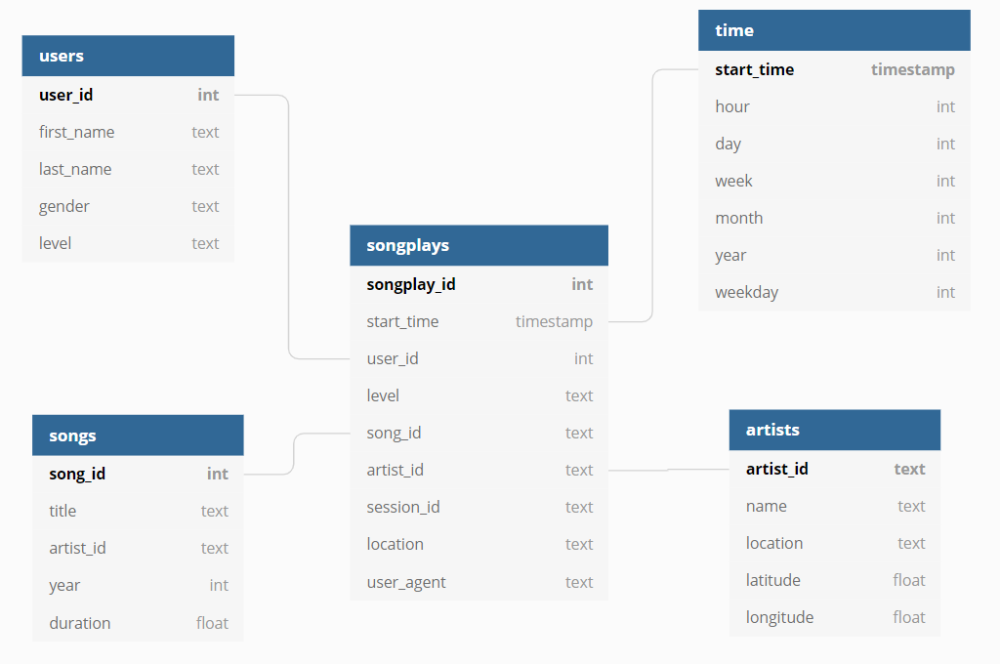

# Sparkify Music Data Modeling with Postgres

## Contents

1. [Introduction](#Introduction)
2. [Project Description](#motivation)
3. [Source Data](#Datasets)
4. [Database Schema](#Schema)
5. [Scripts](#Scripts)
6. [Getting Started](#Getting Started)

## Introduction<a name="installation"></a>

A startup Sparkify Music wants to analyze the data they've been collecting on songs and user activity on their new music streaming app. The analytics team is particularly interested in understanding what songs users are listening to. Currently, they don't have an easy way to query their data, which resides in a directory of JSON logs on user activity on the app, as well as a directory with JSON metadata on the songs in their app.

## Project Description<a name="motivation"></a>

This project is to create a Postgres database and ETL pipeline to optimize queries on song play analysis. First, we define fact and dimension tables for a star schema for a particular analytic focus, then write an ETL pipeline that transfers data from raw files in the data directory into these tables in Postgres using Python and SQL

## Source Data <a name="Datasets"></a>

### Song Dataset

The first dataset, located in data/song_data, is a subset of real data from the [Million Song Dataset](http://millionsongdataset.com/). Each file is in JSON format and contains metadata about a song and the artist of that song. The files are partitioned by the first three letters of each song's track ID. For example, here are filepaths to two files in this dataset.

`song_data/A/B/C/TRABCEI128F424C983.json`</br>
`song_data/A/A/B/TRAABJL12903CDCF1A.json`

And below is an example of what a single song file, TRAABJL12903CDCF1A.json, looks like.

```json
{"num_songs": 1, "artist_id": "ARJIE2Y1187B994AB7", "artist_latitude": null, "artist_longitude": null, "artist_location": "", "artist_name": "Line Renaud", "song_id": "SOUPIRU12A6D4FA1E1", "title": "Der Kleine Dompfaff", "duration": 152.92036, "year": 0}
```

### Log Dataset

The second dataset, located in data/log_data, consists of log files in JSON format generated by this [event simulator](https://github.com/Interana/eventsim) based on the songs in the dataset above. These simulate activity logs from a music streaming app based on specified configurations.

The log files are partitioned by year and month. For example, here are filepaths to two files in this dataset.

`log_data/2018/11/2018-11-12-events.json`</br>
`log_data/2018/11/2018-11-13-events.json`


And below is an example of what the data in a log file, 2018-11-12-events.json, looks like.


## Database Schema <a name="Schema"></a>

### Fact Table
1. **songplays** - records in log data associated with song plays i.e. records with page NextSong

songplay_id, start_time, user_id, level, song_id, artist_id, session_id, location, user_agent

### Dimension Tables
2. **users** - users in the app

user_id, first_name, last_name, gender, level

3. **songs** - songs in music database

song_id, title, artist_id, year, duration

4. **artists** - artists in music database

artist_id, name, location, latitude, longitude

5. **time** - timestamps of records in songplays broken down into specific units

start_time, hour, day, week, month, year, weekday



## Scripts <a name="Scripts"></a>

- **create_tables.py** - Removes previous database if exists, creates new schema.
- **etl.py** - Reads and processes all song datasets and log datasets, then loads into the database.
- **sql_queries.py** - Stores all SQL commands, that are used in database removal, creation, insertion, imported into create_tables.py and etl.py.

## Getting Started <a name="Getting Started"></a>

`python create_tables.py`</br>
`python etl.py`

